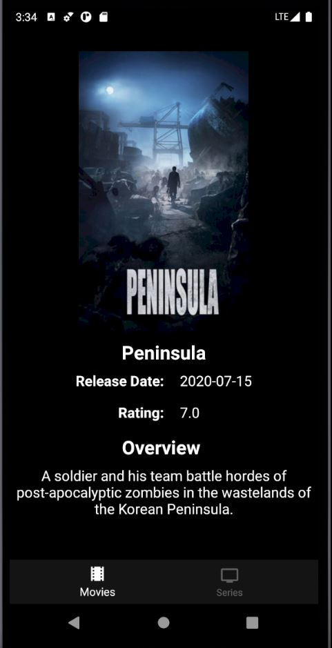

# INSTAFLIX

## Table of contents
* [General info](#general-info)
* [Technologies](#technologies)
* [Flow](#flow)
* [Improvements](#improvements)

## General info
app for listing movies and series, it implements MVVM

## Technologies
Project is created with:
* MVVM architecture
* Koin for dependency injection
* Retrofit for api comsuption
* Navigation components
* RxJava
* Glide for image loading

## Flow
The application has a home activity with a BottomNavigationView with two options, Movies and Series

 

This is the home view

 

And this is the detail view of a Series or a Movies

 

## Improvements
This app can implement a persistence framework like Room
